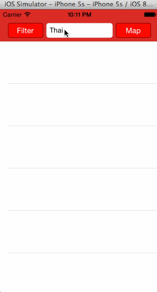

# RottenTomatoes Box Office Demo

This is an iOS Swift demo application for displaying the Yelp search and filter using the [Yelp API](http://www.yelp.com/developers/documentation/v2/search_api). This application uses [CodePath's Swift Yelp client](https://github.com/thecodepath/ios_yelp_swift) to to make unauthenticated requests to their search API.

Time spent: 10 hours spent in total

Completed user stories:

 * [x] Required: Table rows should be dynamic height according to the content height
 * [x] Required: Custom cells should have the proper Auto Layout constraints
 * [x] Required: Search bar should be in the navigation bar (doesn't have to expand to show location like the real Yelp app does).
 * [x] Required: The filters you should actually have are: category, sort (best match, distance, highest rated), radius (meters), deals (on/off).
 * [x] Required: You can use the default UISwitch for on/off states.
 settings.

  

